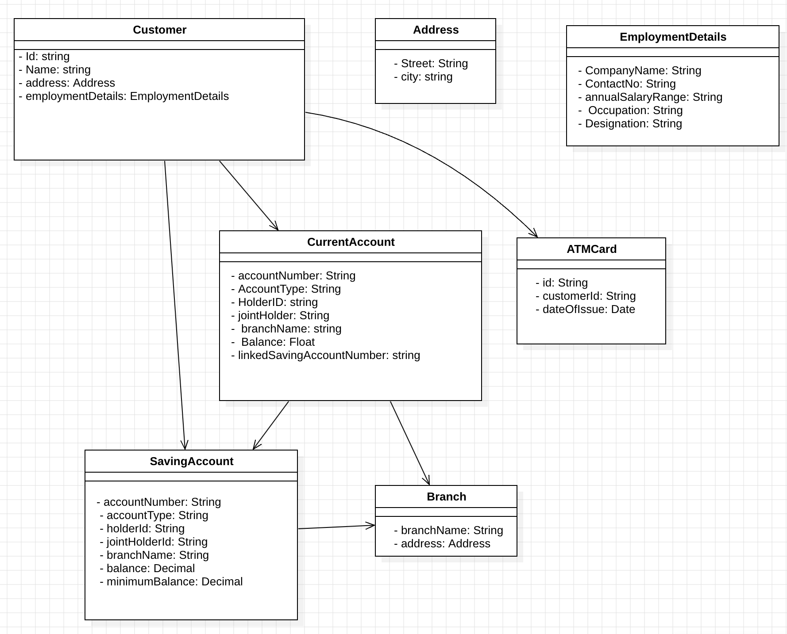

# Domain Drive Design for a banking system

### Bounded Contexts:
- Customer Management: Handles customer data and ATM cards
- Account Management: Manages all account types and operations
- Branch Management: Maintains branch information

### Aggregates:
- Customer Aggregate (root: Customer, includes EmploymentDetails and ATMCard)
- Account Aggregate (root: Account, includes SavingAccount and CurrentAccount)

### Entities:
- Customer: Main entity with personal details
- Account: Abstract base for account types
- SavingAccount: Specific account type with minimum balance
- CurrentAccount: Specific account type with linked saving account 
- Branch: Physical bank location
- ATMCard: Card associated with customer

### Value Objects: 
- EmploymentDetails: Composite value describing customer's employment 
 
### Relationships Explanation:
1. A Customer can hold multiple Accounts (1-to-many)
2. An Account has one primary holder (Customer) and optionally one joint holder (Customer)
3. Each Account is associated with exactly one Branch

4. A Branch contains many Accounts but doesn't maintain direct references (weak association)

5. A Customer may have 0 or 1 ATMCard

6. EmploymentDetails is a value object owned by Customer

7. Account has two subtypes: SavingAccount and CurrentAccount

8. CurrentAccount has a reference to a linked SavingAccount