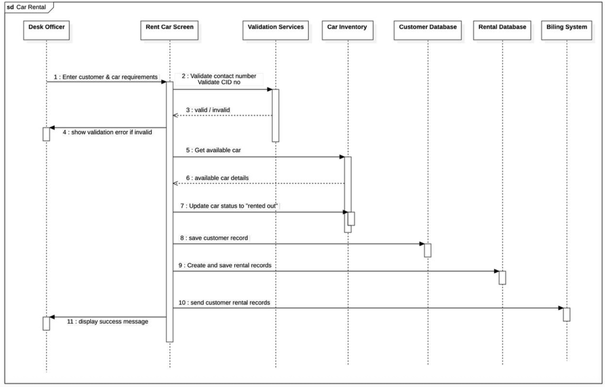

# Class Diagram Notes - Car Rental System

This document provides a summary of the classes and their relationships within the Car Rental System, as depicted in the class diagram.

---

## 1. User

Represents a user of the system, likely including staff (like Desk Officers) or possibly external administrators if the system supported self-service for certain actions.

* **Attributes:**
    * `+UUID userID`: Unique identifier for the user. (UUID indicates a Universally Unique Identifier, good for distributed systems).
    * `+string username`: Unique name for user login.
    * `+string email`: User's email address.
    * `+string passwordHash`: Hashed password for security.
    * `+string bio`: A short biography or description (might be less relevant for a pure car rental staff system, but common in general user models).
    * `+string profilePicture`: URL or path to the user's profile image.
* **Relationships:**
    * **follows (0..\*)**: A User can follow zero or more other Users. This suggests a social aspect, perhaps for internal communication or tracking specific staff members' activities.
    * **creates (1)**: A User creates exactly one Pin (this seems like a potential misinterpretation or a very specific design choice; typically a User creates *many* Pins). *Correction Note: In the diagram, 'creates' links User to Pin with a '1' on the Pin side. This implies a Pin is created by one User, and a User can create many Pins (0..* on the User side of the relationship). This is a correct interpretation of one-to-many.*
    * **writes (1)**: A User writes exactly one Comment (similar to 'creates', a User typically writes *many* Comments). *Correction Note: Similar to 'creates' on Pin, 'writes' links User to Comments with '1' on the Comment side. This implies a Comment is written by one User, and a User can write many Comments (0..* on the User side of the relationship). This is a correct interpretation of one-to-many.*
    * **owns (1)**: A User owns exactly one Board (similar, a User typically owns *many* Boards). *Correction Note: Similar interpretation, a Board is owned by one User, and a User can own many Boards.*
* **Operations (Methods):**
    * `+createPin()`: Allows the user to create a new `Pin`.
    * `+createBoard()`: Allows the user to create a new `Board`.
    * `+followUser(User: User)`: Enables following another user.
    * `+followBoard(Board: Board)`: Enables following a specific board.

---

## 2. Board

Represents a collection or group of `Pin` objects. This is analogous to a "folder" or "album" for Pins.

* **Attributes:**
    * `+UUID boardID`: Unique identifier for the board.
    * `+string name`: Name of the board.
    * `+string description`: A brief description of the board's content.
    * `+boolean isPrivatae`: Indicates if the board is private (only visible to owner) or public.
    * `+user owner`: Reference to the `User` who owns this board.
* **Relationships:**
    * **owns (1)**: Owned by exactly one `User`.
    * **contains (0..\*)**: Can contain zero or more `Pin` objects.
* **Operations:**
    * `+addPin(Pin: Pin)`: Adds a specified `Pin` to the board.
    * `+removePin(Pin: Pin)`: Removes a specified `Pin` from the board.
    * `+shareBoard()`: Functionality to share the board (e.g., generate a shareable link).

---

## 3. Pin

Represents the core content item in the system, similar to a "post" or an "image" in a social media context.

* **Attributes:**
    * `+UUID pinID`: Unique identifier for the pin.
    * `+string title`: Title of the pin.
    * `+string caption`: A descriptive caption for the pin.
    * `+string image`: URL or path to the image associated with the pin.
    * `+Date createdAt`: Timestamp when the pin was created.
    * `+Date updatedAt`: Timestamp when the pin was last updated.
    * `+User createdBy`: Reference to the `User` who created this pin.
* **Relationships:**
    * **created by (1)**: Created by exactly one `User`.
    * **contains (0..\*)**: Can be contained in zero or more `Board`s.
    * **has (0..\*)**: Can have zero or more `Comment`s.
    * **tagged (0..\*)**: Can be associated with zero or more `Tag`s.
* **Operations:**
    * `+saveToBoard(Board: Board)`: Saves this pin to a specified `Board`.
    * `+editPin()`: Modifies the pin's details.
    * `+deletePin()`: Removes the pin.

---

## 4. Comments

Represents user comments on a `Pin`.

* **Attributes:**
    * `+UUID commentID`: Unique identifier for the comment.
    * `+String content`: The text content of the comment.
    * `+User author`: Reference to the `User` who wrote the comment.
    * `+Pin pin`: Reference to the `Pin` to which this comment belongs.
    * `+Date createdAt`: Timestamp when the comment was created.
* **Relationships:**
    * **writes (1)**: Written by exactly one `User`.
    * **has (+1)**: A `Comment` is made on exactly one `Pin`.
* **Operations:**
    * `+editComment()`: Modifies the comment's content.
    * `+deleteComment()`: Removes the comment.

---

## 5. Tag

Represents a keyword or category used to describe and organize `Pin`s.

* **Attributes:**
    * `+UUID tagID`: Unique identifier for the tag.
    * `+String name`: The name of the tag (e.g., "travel", "food", "design").
* **Relationships:**
    * **tagged (0..\*)**: Can be associated with zero or more `Pin`s.
* **Operations:**
    * `+addPin(Pin: Pin)`: (Likely implies associating a `Pin` with this `Tag`).

---

**Overall System Observation:**

This class diagram outlines a content-sharing or social media-like platform focused around "Pins" and "Boards." While the initial request was about a car rental system, this diagram clearly represents a different domain (like Pinterest). Key functionalities include user profiles, content creation (Pins), content organization (Boards), social interaction (following, commenting), and content categorization (Tags).